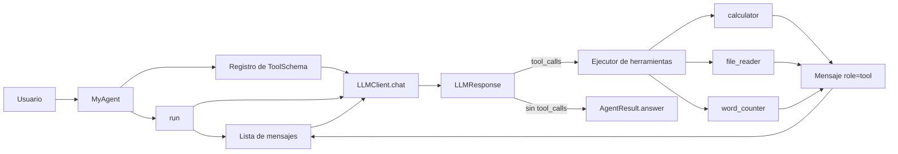

## Informe obligatorio

### 1. Diagrama de arquitectura (cajas y flechas)



- Usuario tiene una pregunta o mensaje
- student_framework inicializa un MyAgent, registra las herramientas y llama al método run()
- MyAgent.run() instancia una lista de mensajes y le pasa el primer mensaje del usuario al LLMClient.chat() junto con la lista de ToolSchema registrados.
- LLMClient.chat() se comunica con el backend LLM (Ollama) y obtiene una respuesta (LLMResponse).
- Si la respuesta contiene tool_calls, MyAgent parsea los argumentos, ejecuta cada herramienta invocada, genera un mensaje de role=tool con el resultado o error, lo agrega a la lista de mensajes y vuelve a llamar a LLMClient.chat() con la lista actualizada.
- Si la respuesta no contiene tool_calls, el contenido textual se devuelve como AgentResult.answer y el bucle termina.

### 2. Diseño de la interfaz de herramientas

Se siguio el patron callable tipado + esquema derivado automaticamente:

1. Cada herramienta define parametros con `Annotated` + `Field(description=...)`.
2. El esquema se genera con `ToolSchema.from_callable(fn)`.
3. `register_tool` guarda dos mapas internos:
   - self._tools[nombre_tool] -> callable, se utiliza en el bucle para ejecutar la herramienta.
   - self._schemas[nombre_tool] -> ToolSchema, se pasa al LLM en cada llamada para que conozca las herramientas disponibles.
4. En cada vuelta del bucle, el agente invoca `chat(..., tools=list(self._schemas.values()), ...)`.
5. El `LLMClient` fijo toma cada `ToolSchema` y lo adapta al formato del proveedor (Ollama), desacoplando al agente del backend concreto.

Implementacion actual:

1. `calculator`:
   - Entrada: `left_operand`, `operator`, `right_operand`
   - Operadores: `+`, `-`, `*`, `%`
   - Salida: `str`
   - Ejemplo de uso: `python -m mia_agents.cli run --module student_framework --message "¿Cuánto es 17 * 23? Usá la calculadora."`
2. `file_reader`:
   - Entrada: `path`
   - Salida: contenido de texto UTF-8 como `str`
      - Ejemplo de uso: `python -m mia_agents.cli run --module student_framework   --message  "¿What is the name of the manager according to /home/felipe/git/udesa/tp_mia_agentes_2026/student_framework/test/data.txt?"`
3. `word_counter`:
   - Entrada: `str`
   - Salida: `Int`
   - Ejemplo de uso: `python -m mia_agents.cli run --module student_framework --message "Cuantas palabras contiene el texto 'Esta es mi materia preferida de la maestría. Aguante boca.'"`

Ejemplo de uso de un prompt que utiliza más de una herramienta:

```bash
python -m mia_agents.cli run --module student_framework   --message "A manager's current salary is located in /home/felipe/git/udesa/tp_mia_agentes_2026/student_framework/test/data.txt. If the manager's salary is doubled, how much would they earn? Remember to use your tools for reading files and calculating."
```


### 3. Como termina el bucle y que pasa al llegar al limite

Condicion de parada M1 implementada:

1. Se llama al LLM con el mensaje del usuario.
2. Si la respuesta trae `tool_calls`:
   - Se parsean `arguments` JSON.
   - Se ejecuta cada herramienta.
   - Se agrega un mensaje `role=tool` con resultado o error.
   - Se registra un `AgentStep` por invocacion.
   - Se vuelve a llamar al LLM.
3. Si la respuesta no trae `tool_calls`:
   - El contenido textual se devuelve en `AgentResult.answer`.
   - El bucle termina.
4. Si se alcanza `max_iterations`:
   - Se corta el bucle.
   - Se devuelve `AgentResult` valido con error indicando limite alcanzado.
5. Nunca se rompe el contrato de retorno: `run` siempre devuelve `AgentResult`.

### 4. Limitaciones conocidas

1. `file_reader` requiere que le pases la ruta explícita al archivo, no hay navegación de directorios ni manejo de rutas relativas.